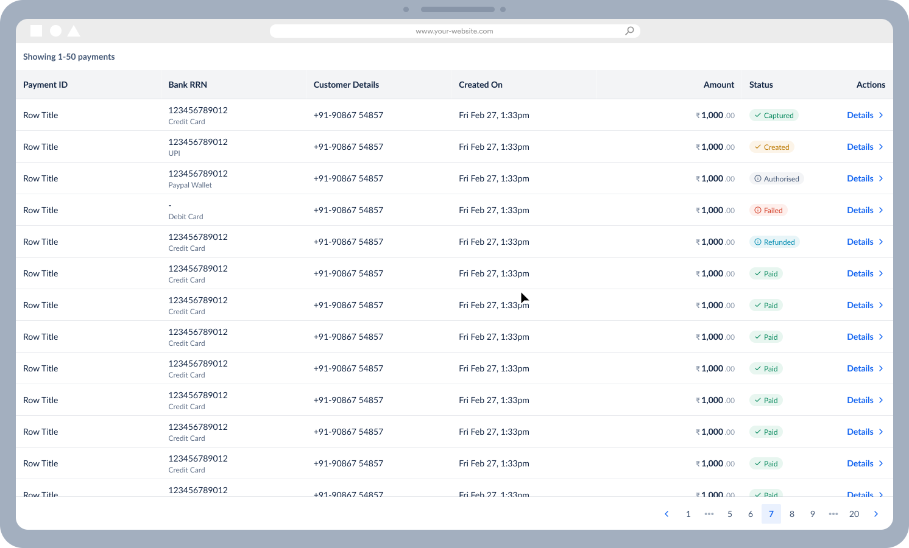
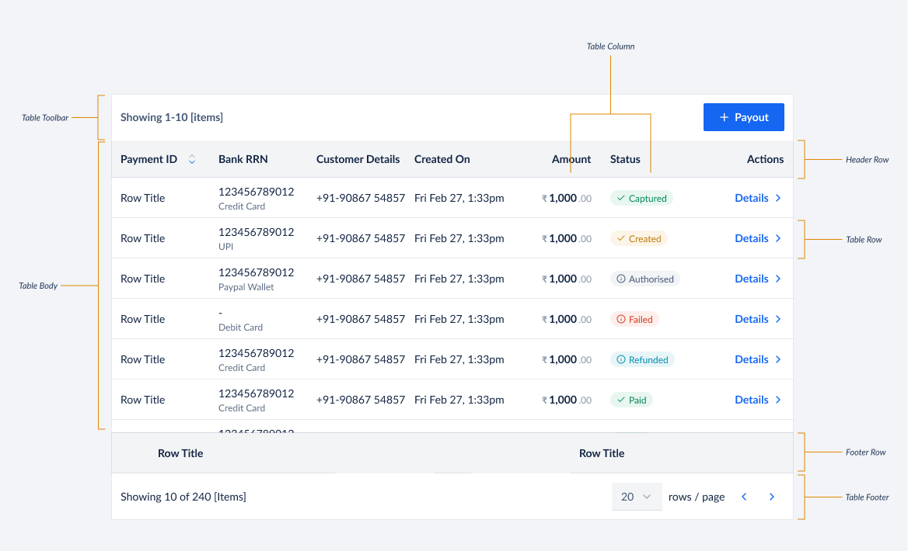

# Table API Decisions <!-- omit in toc -->

A table component helps in displaying data in a grid format, through rows and columns of cells. Table facilitates data organisation and allow users to: scan, sort, compare, and take action on large amounts of data.



- [Features](#features)
- [Out of scope](#out-of-scope)
- [Anatomy](#anatomy)
- [API](#api)
  - [Example Usage](#example-usage)
  - [Detailed API](#detailed-api)
    - [Table](#table)
      - [`TableData`](#tabledata)
      - [`SortFunctionsType`](#sortfunctionstype)
      - [`SortChangeEvent`](#sortchangeevent)
      - [`SelectionChangeEvent`](#selectionchangeevent)
    - [TableToolbar](#tabletoolbar)
    - [TableToolbarActions](#tabletoolbaractions)
    - [TableHeader](#tableheader)
    - [TableHeaderRow](#tableheaderrow)
    - [TableHeaderCell](#tableheadercell)
    - [TableBody](#tablebody)
    - [TableRow](#tablerow)
    - [TableCell](#tablecell)
    - [TableFooter](#tablefooter)
    - [TableFooterRow](#tablefooterrow)
    - [TableFooterCell](#tablefootercell)
    - [TablePagination](#tablepagination)
      - [`PageChangeEvent`](#pagechangeevent)
      - [`onPageSizeChange`](#onpagesizechange)
  - [API Design Decisions](#api-design-decisions)
    - [1. Composable API](#1-composable-api)
      - [Pros](#pros)
      - [Cons](#cons)
    - [2. Compact API](#2-compact-api)
      - [Pros](#pros-1)
      - [Cons](#cons-1)
    - [Comparison](#comparison)
    - [Decision](#decision)
      - [1. Only Composable API](#1-only-composable-api)
      - [2. Only Compact API](#2-only-compact-api)
      - [3. Both Composable \& Compact API](#3-both-composable--compact-api)
      - [Current API Usage Across Klear Projects](#current-api-usage-across-klear-projects)
      - [Conclusion](#conclusion)
- [Table Library Evaluation](#table-library-evaluation)
  - [Why a library?](#why-a-library)
  - [What are we looking for in a library?](#what-are-we-looking-for-in-a-library)
  - [Libraries evaluated](#libraries-evaluated)
    - [Heavy sized library - AG Grid](#heavy-sized-library---ag-grid)
    - [Medium sized library - Tanstack's React Table](#medium-sized-library---tanstacks-react-table)
    - [Small sized library - React Table Library](#small-sized-library---react-table-library)
    - [Comparison](#comparison-1)
- [Accessibility](#accessibility)

## Features

- Column Sorting
- Column Filtering & Search (global + per-column)
- Row Selection - Single & Multiple
- Row Expansion (grouped/parent-child rows)
- Pagination
- Bulk Actions Toolbar
- Horizontally Scrollable
- Sticky Columns (leading and trailing)
- Sticky Header
- Sticky Footer
- Cell Density - Normal & Comfortable

## Out of scope

We don't have enough use-cases for the following features at Klear and hence scoped them out of our Table component. If you are aware of any of these features being used at Klear, please let us know by creating an issue - we will evaluate it and scope it for future releases.

- Column Reordering
- Column Resizing
- Nested Tables
- Hiding Columns
- Editable Rows
- Table for React Native
  - Mobile Apps will be using Lists instead of Tables to convey information

## Anatomy



## API

### Example Usage

```jsx
<Table
    data={data} // This contains the actual data to be rendered in the table which would be retrieved from some API
    selectionType='single'
    onSelectionChange={onSelectionChange}
    sortFunctions={sortFunctions}
    onSortChange={onSortChange}
    isLoading={false}
    isStickyHeader={true}
    isStickyFooter={true}
    isStickyFistColumn={true}
    rowDensity='normal'
    showStripedRows={true}
    pagination={()=>(
        <TablePagination
          defaultPageSize={10}
          label='1-10 of 100'
          showLabel='left'
          showPageSizePicker
          showPageNumberSelector
          onPageChange={console.log}
          onPageSizeChange={console.log}
        />
      )}
   toolbar={()=>(
        <TableToolbar title="Users" itemsSelectedTitle={`${selectedUsersCount} Users selected`}>
            <ToolbarActions>
                <Button>Export</Button>
            </ToolbarActions>
        </TableToolbar>
      )}
>
{(tableData) => (
  <>
    <TableHeader>
      <TableHeaderRow>
         <TableHeaderCell headerKey='firstName'>
          First Name
        </TableHeaderCell>
        <TableHeaderCell headerKey='lastName'>
          Last Name
        </TableHeaderCell>
        <TableHeaderCell headerKey='balance'>
          Balance
          <Tooltip content='Current bank balance'>
            <InfoIcon size='medium' />
          </Tooltip>
        </TableHeaderCell>
       </TableHeaderRow>
     </TableHeader>

    <TableBody>
      {tableData.map((row) => (
        <TableRow onClick={console.log} isDisabled={false}>
          <TableCell>
            {row.firstName}
          </TableCell>
          <TableCell>
            {row.lastName}
          </TableCell>
          <TableCell>
            {row.balance}
            <Badge>Low</Badge>
          </TableCell>
        <TableRow>
      )}
    </TableBody>

    <TableFooter>
      <TableFooterRow>
        <TableFooterCell>
          Total
        </TableFooterCell>
        <TableFooterCell>
          {computedTotalBalance}
        </TableFooterCell>
      </TableFooterRow>
    </TableFooter>
   </>
  )
}
</Table>
```

### Detailed API

> We will be using Composable API for Table

#### Table

| Prop               | Type                                          | Default     | Description                                                                                                                                                                                                                                                                                                                              | Required |
| ------------------ | --------------------------------------------- | ----------- | ---------------------------------------------------------------------------------------------------------------------------------------------------------------------------------------------------------------------------------------------------------------------------------------------------------------------------------------- | -------- |
| data               | TableData                                     | `undefined` | This contains the actual data to be rendered in the table which would be retrieved from some API                                                                                                                                                                                                                                         | ✅       |
| children           | `(tableData: TableData) => React.ReactNode[]` | undefined   | Expects a function that returns Table composition components like `TableHeader`, `TableBody` & `TableFooter`. The function provides the tableData as an argument which can be used to render the table. The provided tableData will update based on pagination and sort states.                                                          | ✅       |
| selectionType      | `none`, `single`, `multiple`                  | `none`      | This defines the type of selection that is allowed in the table. Possible values are 'none', 'single' & 'multiple'                                                                                                                                                                                                                       |
| filterFunctions    | `FilterFunctionsType`                         | `undefined` | This is an object that contains the filter predicates for each column. The key of the object should be the `headerKey` of the column and the value is a function that takes in an item and the current filter value and returns whether the item should be kept. A column will be made automatically filterable by adding its headerKey here — same convention as `sortFunctions`. |
| onSelectionChange  | `SelectionChangeEvent`                        | `undefined` | This is a callback function that is called when the selection changes. It is called with the selected items as an array                                                                                                                                                                                                                  |
| sortFunctions      | `SortFunctionsType`                           | `undefined` | This is an object that contains the sort functions for each column. The key of the object should be the `headerKey` of the column and the value is a function that takes in an array of items and returns a sorted array of items. A column will be made automatically sortable by adding its headerKey along with a sort function here. |
| onSortChange       | `SortChangeEvent`                             | `undefined` | This is a callback function that is called when the sort changes. It is called with the headerKey & sortType as arguments                                                                                                                                                                                                                |
| isLoading          | `boolean`                                     | `false`     | This defines whether the table is in a loading state or not                                                                                                                                                                                                                                                                              |
| isRefreshing       | `boolean`                                     | `false`     | This defines whether the table is in a refreshing state or not                                                                                                                                                                                                                                                                           |
| rowDensity         | `normal`, `comfortable`                       | `normal`    | This defines the density of the cells in the table. Possible values are 'normal' & 'comfortable'                                                                                                                                                                                                                                         |
| showStripedRows    | `boolean`                                     | `false`     | This defines whether the table should show zebra stripes or not                                                                                                                                                                                                                                                                          |
| pagination         | `React.ReactElement`                          | `undefined` | Expects the TablePagination Component                                                                                                                                                                                                                                                                                                    |
| toolbar            | `React.ReactElement`                          | `undefined` | Expects the TableToolbar Component                                                                                                                                                                                                                                                                                                       |
| isStickyHeader     | `boolean`                                     | `false`     | This defines whether the table header should be sticky or not                                                                                                                                                                                                                                                                            |
| isStickyFooter     | `boolean`                                     | `false`     | This defines whether the table footer should be sticky or not                                                                                                                                                                                                                                                                            |
| isStickyFistColumn | `boolean`                                     | `false`     | This defines whether the first column of the table should be sticky or not. Equivalent to `stickyColumnCount={1}`.                                                                                                                                                                                                                       |
| stickyColumnCount  | `number`                                      | `0`         | Number of leading columns (after any multi-select checkbox column) to freeze while the rest of the table scrolls horizontally. Freezing more than one column requires `stickyColumnWidths`, since offsets are computed from known widths rather than measured at render time.                                                          |
| stickyColumnWidths | `string[]`                                    | `undefined` | Explicit pixel width for each of the leading `stickyColumnCount` columns, in order. Pair these with matching `width`s on the same columns (via the `columns` config or `gridTemplateColumns`).                                                                                                                                          |
| isLastColumnSticky | `boolean`                                     | `false`     | This defines whether the last column of the table should be sticky or not. Equivalent to `trailingStickyColumnCount={1}`.                                                                                                                                                                                                                |
| trailingStickyColumnCount | `number`                                | `0`         | Number of trailing columns (right to left, before any hover-actions column) to freeze while the rest of the table scrolls horizontally. Freezing more than one column requires `trailingStickyColumnWidths`.                                                                                                                            |
| trailingStickyColumnWidths | `string[]`                             | `undefined` | Explicit pixel width for each of the trailing `trailingStickyColumnCount` columns, in left-to-right order. Pair these with matching `width`s on the same columns (via the `columns` config or `gridTemplateColumns`).                                                                                                                   |
| surfaceLevel       | `1`, `2`, `3`                                 | `2`         | This defines the surface level of the table. Possible values are `1`, `2` & `3`                                                                                                                                                                                                                                                          |

##### `TableData`

```ts
type TableNode = {
  id: Identifier;
  nodes?: null;
  [key: string]: unknown;
};

// we might want to add more meta information here in the future (could need some for pagination. Will update this as we go.)
type TableData = {
  nodes: TableNode[];
};
```

##### `SortFunctionsType`

```ts
type SortFunctionsType = {
  [key: string]: (array: TableNode[]) => TableNode[];
};
```

##### `SortChangeEvent`

```ts
type SortChangeEvent = {
  sortKey: string;
  isSortReversed: boolean;
};
```

##### `SelectionChangeEvent`

```ts
type SelectionChangeEvent = (selectedItems: TableNode[]) => void;
```

#### TableToolbar

| Prop               | Type              | Default   | Description                                                         | Required |
| ------------------ | ----------------- | --------- | ------------------------------------------------------------------- | -------- |
| title              | `string`          | undefined | This defines the title of the table toolbar                         |          |
| itemsSelectedTitle | `string`          | undefined | This defines the title of the table toolbar when items are selected |          |
| children           | `React.ReactNode` | undefined | This defines the actions to be shown in the table toolbar           |          |

#### TableToolbarActions

| Prop     | Type              | Default   | Description                                               | Required |
| -------- | ----------------- | --------- | --------------------------------------------------------- | -------- |
| children | `React.ReactNode` | undefined | This defines the actions to be shown in the table toolbar |

#### TableHeader

| Prop     | Type              | Default   | Description                        | Required |
| -------- | ----------------- | --------- | ---------------------------------- | -------- |
| children | `React.ReactNode` | undefined | This defines the table header rows | ✅       |

#### TableHeaderRow

| Prop     | Type              | Default   | Description                         | Required |
| -------- | ----------------- | --------- | ----------------------------------- | -------- |
| children | `React.ReactNode` | undefined | This defines the table header cells | ✅       |

#### TableHeaderCell

| Prop      | Type                         | Default   | Description                                                                  | Required |
| --------- | ---------------------------- | --------- | ---------------------------------------------------------------------------- | -------- |
| headerKey | `string`                     | undefined | This defines the header key of the column                                    | ✅       |
| children  | `React.ReactNode` , `string` | undefined | This defines the content of the table header cell. Can be a JSX or a string. | ✅       |

#### TableBody

| Prop     | Type              | Default   | Description                      | Required |
| -------- | ----------------- | --------- | -------------------------------- | -------- |
| children | `React.ReactNode` | undefined | This defines the table body rows | ✅       |

#### TableRow

| Prop       | Type              | Default   | Description                                     | Required |
| ---------- | ----------------- | --------- | ----------------------------------------------- | -------- |
| children   | `React.ReactNode` | undefined | This defines the table body cells               | ✅       |
| isDisabled | `boolean`         | false     | This defines whether the row is disabled or not |

#### TableCell

| Prop     | Type                        | Default   | Description                                                    | Required |
| -------- | --------------------------- | --------- | -------------------------------------------------------------- | -------- |
| children | `React.ReactNode`, `string` | undefined | This defines the content of the cell. Can be a JSX or a string | ✅       |

#### TableFooter

| Prop     | Type              | Default   | Description                        | Required |
| -------- | ----------------- | --------- | ---------------------------------- | -------- |
| children | `React.ReactNode` | undefined | This defines the table footer rows | ✅       |

#### TableFooterRow

| Prop     | Type              | Default   | Description                         | Required |
| -------- | ----------------- | --------- | ----------------------------------- | -------- |
| children | `React.ReactNode` | undefined | This defines the table footer cells | ✅       |

#### TableFooterCell

| Prop     | Type                        | Default   | Description                                                                  | Required |
| -------- | --------------------------- | --------- | ---------------------------------------------------------------------------- | -------- |
| children | `React.ReactNode`, `string` | undefined | This defines the content of the table footer cell. Can be a JSX or a string. | ✅       |

#### TablePagination

| Prop               | Type                  | Default                          | Description                                                                                                                                                           | Required |
| ------------------ | --------------------- | -------------------------------- | --------------------------------------------------------------------------------------------------------------------------------------------------------------------- | -------- |
| currentPage        | `number`              | undefined                        | This defines the current page of the table. If you pass currentPage, this becomes a controlled component and you will have to manage page selection state on your own |          |
| defaultPageSize    | `number`              | `10`                              | This defines the default number of items to be shown per page                                                                                                         |          |
| pageSizeOptions    | `number[]`            | `[10, 25, 50]`                    | The page size choices shown in the page size picker. Not limited to the default three values.                                                                        |          |
| label              | `string`              | undefined                        | This defines the label to be shown in the pagination                                                                                                                  |
| showLabel          | `boolean`             | `false`                          | This defines whether the label should be shown or not                                                                                                                 |
| showPageSizePicker | `boolean`             | `false`                          | This defines whether the page size picker should be shown or not                                                                                                      |
| onPageChange       | `PageChangeEvent`     | undefined                        | This is a callback function that is called when the currentPage changes                                                                                               |
| onPageSizeChange   | `PageSizeChangeEvent` | undefined                        | This is a callback function that is called when the pageSize changes                                                                                                  |

##### `PageChangeEvent`

```ts
type PageChangeEvent = ({ page: number }) => void;
```

##### `onPageSizeChange`

```ts
type PageSizeChangeEvent = ({ pageSize: number }) => void;
```

### API Design Decisions

> You can skip this section and go to [Table Library Evaluation](#table-library-evaluation) if you are not interested in the API design process. The [Final API](#api) has already been documented above.
> The decision was made to go ahead with Composable API after consulting with the frontend leads

While evaluating what kind of API we want for our table, we discovered 2 approaches:

#### 1. Composable API

Composable API is a pattern where we have a set of components that can be composed together to create a table. This approach allows us to stitch together a table very similar to how you would do it with native HTML. However, it is also more verbose and requires more effort to create a table.

```jsx
// Mock data & functions

const data = [
  {
    firstName: 'John',
    lastName: 'Doe',
    balance: 1000,
  },
  {
    firstName: 'Jane',
    lastName: 'Doe',
    balance: 2000,
  },
];

const sortFunctions = {
  firstName: (array) => array.sort((a, b) => a.name.localeCompare(b.name)),
};

const onSelectionChange = (selectedItems) => {
  console.log(selectedItems);
};

const onSortChange = ({ headerKey, sortType }) => {
  console.log({ headerKey, sortType });
};
```

```jsx
// Composable Table

<Table
    data={data} // This contains the actual data to be rendered in the table which would be retrieved from some API
    selectionType='single'
    onSelectionChange={onSelectionChange}
    sortFunctions={sortFunctions}
    onSortChange={onSortChange}
    isLoading={false}
    rowDensity='normal'
    showStripedRows={true}
    pagination={()=>(
        <TablePagination
          defaultPageSize={10}
          label='1-10 of 100'
          showLabel='left'
          showPageSizePicker
          showPageNumberSelector
          onPageChange={console.log}
          onPageSizeChange={console.log}
        />
      )}
   toolbar={()=>(
        <TableToolbar title="Users" itemsSelectedTitle={`${selectedUsersCount} Users selected`}>
            <ToolbarActions>
                <Button>Export</Button>
            </ToolbarActions>
        </TableToolbar>
      )}
>
{(tableData) => (
  <>
    <TableHeader>
      <TableHeaderRow>
         <TableHeaderCell headerKey='firstName'>
          First Name
        </TableHeaderCell>
        <TableHeaderCell headerKey='lastName'>
          Last Name
        </TableHeaderCell>
        <TableHeaderCell headerKey='balance'>
          Balance
          <Tooltip content='Current bank balance'>
            <InfoIcon size='medium' />
          </Tooltip>
        </TableHeaderCell>
       </TableHeaderRow>
     </TableHeader>

    <TableBody>
      {tableData.map((row) => (
        <TableRow onClick={console.log} isDisabled={false}>
          <TableCell>
            {row.firstName}
          </TableCell>
          <TableCell>
            {row.lastName}
          </TableCell>
          <TableCell>
            {row.balance}
            <Badge>Low</Badge>
          </TableCell>
        <TableRow>
      )}
    </TableBody>

    <TableFooter>
      <TableFooterRow>
        <TableFooterCell>
          Total
        </TableFooterCell>
        <TableFooterCell>
          {computedTotalBalance}
        </TableFooterCell>
      </TableFooterRow>
    </TableFooter>
   </>
  )
}
</Table>
```

##### Pros

- Composable API is more intuitive and resembles the native HTML structure of a table
- It is easier to understand since the API design is similar to rest of the Klear360 components
- It is easier to extend and add new feature to individual table components
- We could leverage tree-shaking to only import the components that are being used in the consumer's table

##### Cons

- Composable API is more verbose and requires more effort to create a table by composing together multiple components
- Most popular table libraries like AG Grid, React Table, etc. use a compact API which is battle tested and developers are more familiar with the same

#### 2. Compact API

Compact API is a pattern where we have a single component that takes in all the data and renders a table. This approach is more concise and requires less effort to create a table. However, it is also less intuitive and does not resemble the native HTML structure of a table.

```jsx
// Mock data & functions
const data = [{
    firstName: 'John',
    lastName: 'Doe',
    balance: 1000
},
{
    firstName: 'Jane',
    lastName: 'Doe',
    balance: 2000
}];


const sortFunctions = {
  firstName: (array) => array.sort((a, b) => a.name.localeCompare(b.name)),
};

const onSelectionChange = (selectedItems) => {
  console.log(selectedItems);
};

const columnDefinition = [
    {
        header: 'First Name',
        headerKey: 'firstName',
        cell: (row) => row.firstName,
    },
    {
        header: 'Last Name',
        headerKey: 'lastName',
        cell: (row) => row.lastName,
    },
    {
        header: () => (
            <>
                Balance
                <Tooltip content='Current bank balance'>
                    <InfoIcon size='medium' />
                </Tooltip>
            </>),
        headerKey: 'balance',
        cell: (row) => (
            <>
                {row.balance}
                <Badge>Low</Badge>
            </>),
    }
];

const footerDefinition = [
    {
        footer: 'Total',
    },
    {
        footer: computedTotalBalance,
    }
];

const pagination = {
  label?: string,
  defaultPageSize?: number,
  currentPage?: number,
  showLabel?: boolean,
  showPageNumberSelector?: boolean,
  showPageSizePicker?: boolean,
  onPageChange?: ({ page }) => void,
  onPageSizeChange?: ({ pageSize }) => void,
};
```

```jsx
// Compact Table

<Table
  data={data} // This contains the actual data to be rendered in the table which would be retrieved from some API
  columns={columns} // This contains the column definition for the table
  footerRow={footerRow} // This contains the footer definition for the table
  selectionType="single"
  onSelectionChange={onSelectionChange}
  sortFunctions={sortFunctions}
  onSortChange={onSortChange}
  isLoading={false}
  rowDensity="normal"
  showStripedRows={true}
  toolbarTitle="Users"
  toolbarItemsSelectedTitle={`${selectedUsersCount} Users selected`}
  toolbarActions={<Button>Export</Button>}
  isStickyHeader={true}
  isStickyFooter={true}
  isStickyFistColumn={true}
/>
```

##### Pros

- Compact API is more concise and requires less effort to create a table
- Most popular table libraries like AG Grid, React Table, etc. use a compact API which is battle tested and developers are more familiar with the same
- It would be relatively easier to swap out the table library in the future if we decide to do so since the API design is similar to other popular table libraries

##### Cons

- Compact API is less intuitive and does not resemble the native HTML structure of a table
- It is harder to extend and add new feature to the table component since it is a single component
- We would have to import the entire table component even if we are using only a few features of the table resulting in a higher bundle size for the consumer
- Internally, we would have to use a composable API to create the compact API anyway since the library we have chosen has a composable API

#### Comparison

| Aspect                  | Composable API                                                                                                                                     | Compact API                                                                                    |
| ----------------------- | -------------------------------------------------------------------------------------------------------------------------------------------------- | ---------------------------------------------------------------------------------------------- |
| **API Design**          | Multipe components composed together                                                                                                               | Single component that takes all data                                                           |
| **Ease of Use**         | Resembles native HTML table but requires more efforts to write                                                                                     | More concise and requires less effort                                                          |
| **Learning Curve**      | Requires developers to learn about all available Table components & features to compose their own                                                  | Easier to understand what is feasible since its a single component along with TypeScript hints |
| **Extensibility**       | Easier to extend and add new features on individual components                                                                                     | Harder to extend and add new features without making the prop list too large                   |
| **Library Familiarity** | Different than most of the popular table libraries                                                                                                 | Similar to most of the popular table libraries                                                 |
| **Bundle Size**         | Can leverage tree-shaking for smaller bundles (Only components like Pagination & Footer could be omitted, rest of it might still always be needed) | Bundle size would be unaffected regardless of features used within the table by consumer       |
| **Future Library Swap** | May require reworking with different library                                                                                                       | Easier to swap out the library in the future                                                   |

#### Decision

##### 1. Only Composable API

- We could expose only the Composable API to the consumers
- This would take the least amount of implementation time and effort
- Strong reasons to go with this approach would be the composability and tree-shaking benefits
- Strong reasons to not go with this approach would be the verbosity and the fact that it is not the most popular approach within Table libraries ecosystem

##### 2. Only Compact API

- We could expose only the Compact API to the consumers
- This would take the relatively more time and effort since internally we will have to build individual components and stitch them together to create the compact API
- Internally we might not need to put in heavy efforts to ensure composable API is very well structured since we will not be exposing it to the consumers. We would use the composable API internally only to derive the final outcome of a compact API.
- Strong reasons to go with this approach would be the popularity of the compact API within the Table libraries ecosystem
- Strong reasons to not go with this approach would be the lack of composability and tree-shaking benefits

##### 3. Both Composable & Compact API

- We could expose both the Composable & Compact API to the consumers
- This would take the most amount of implementation time and effort since we will have to build both the APIs
- This will add a lot of complexity to the library and will make it harder to maintain. Any changes to the Table component, we will have to ensure both APIs are updated accordingly and always maintain parity
- Swapping out the table library in the future would be challenging since any library we choose we will have to ensure that its feasible to build both kinds of APIs
- Strong reasons to go with this approach would be to give our consumers complete flexibility to choose the API that they are most comfortable with
- Strong reasons to not go with this approach would be the complexity and maintainability issues as well as education efforts required to educate the consumers about both the APIs

##### Current API Usage Across Klear Projects

> This is an approximate usage count. We identified this by searching through the codebase. Actual numbers may vary slightly.

| Project         | Composable API Table Instances | Compact API Table Instances |
| --------------- | ------------------------------ | --------------------------- |
| PG Dashboard    | 101                            | 81                          |
| Admin Dashboard | 19                             | 196                         |
| X Dashboard     | 6                              | 11                          |

##### Conclusion

- We took inputs from Frontend Leads across the org and the majority of them were in favour of the **Composable API** for its **composability** and **tree-shaking benefits**
- Compact API can be built on top of composable API if needed in the future
- We will be going ahead with the **Composable API** for now and will evaluate the need for Compact API in the future

## Table Library Evaluation

### Why a library?

- The primary reason for using a library is to use a battle-tested solution that has been used by a lot of people and has been proven to work well instead of figuring out all the edge cases ourselves
- On a long term we could evaluate swapping it out and building our own solution when the bandwidth and requirements align but until then using an open source library would be the best option

### What are we looking for in a library?

We had a few requirements that we were looking for in a library:

- Well maintained and has a good community around it
- Reasonable bundle size
- Supports all the features that we need today and in the future (including features marked out of scope)
- Flexible styling to ensure we can match the Klear's design language
- Flexible API to ensure we can build both the Composable & Compact APIs

### Libraries evaluated

While evaluating multiple libraries we identified 3 categories:

- **Heavy sized library** with every feature under the sun
- **Medium size library** with all of the features we could need plus some more
- **Small size library** with all the core features we could need

#### Heavy sized library - AG Grid

- [AG Grid](https://www.ag-grid.com/) is the best example of a heavy sized library. It has a lot of features and is very well maintained. However, it is also very heavy and has a lot of features that we don't need.
- As of today, AG Grid's bundle size is 75kb (15kb gzipped) but along with this we also need to install some additional dependency libraries like ag-grid-community which would eventually increase the overall bundle size
- Replicating the Composable API would be a challenging task with React Table since it internally uses API similar to the Compact API. We would have to build a lot of abstractions to ensure we can build the Composable API on top of the Compact API.
- AG Grid is possibly the most battle-tested library but has a ton of features that we won't need and hence would be an overkill for us as of now

#### Medium sized library - Tanstack's React Table

- [Tanstack's React Table](https://react-table.tanstack.com/) is the best example of a medium sized library. It has all the features we need and is very well maintained. However, it is also relatively heavy and has a lot of features that we don't need.
- As of today, React Table's bundle size is 60kb (14kb gzipped).
- Tanstack's React Table has been around for a longer duration and is extremely well maintained. It has relatively less features than AG Grid but also has a lot of features that we don't need.
- Tanstack's React Table is built in a framework agnostic manner which meant they had to use a lot of abstractions to ensure it works well with all the frameworks. This makes it harder to understand, maintain and extend the library.
- Replicating the Composable API would be a challenging task with React Table since it internally uses API similar to the Compact API. We would have to build a lot of abstractions to ensure we can build the Composable API on top of the Compact API.
- React Table is possibly our 2nd best option if we ever need more complex tables in the future but as of now it would be an overkill for us

#### Small sized library - React Table Library

- [React Table Library (@table-library/react-table-library)](https://github.com/table-library/react-table-library) is the best example of a small sized library. It has all the features we need and is relatively well maintained.
- It contains all the features we need today as well as the ones we can forsee needing in the future
- As of today, React Table Library's bundle size is 23kb (7kb gzipped).
- React Table Library has a Composable API using which we can build our Composable as well as Compact API
- React Table Library also exposes a minimal Compact API but we cannot use that directly to build our Compact API since there isn't a parity between their own Composable & Compact APIs
- React Table Library is our best option as of today since it has all the features we could need and is relatively lightweight

#### Comparison

| Library                                                                     | Features                                                      | Bundle Size                                             | Composable API       | Compact API   | Maintenance                                             | Our Choice |
| --------------------------------------------------------------------------- | ------------------------------------------------------------- | ------------------------------------------------------- | -------------------- | ------------- | ------------------------------------------------------- | ---------- |
| [AG Grid](https://www.ag-grid.com/)                                         | Very heavy and has a lot of features we don't need            | 75kb (15kb gzipped) (+ additional supporting libraries) | Challenging to build | Easy to build | Extremely well maintained. Has paid Enterprise support. |
| [Tanstack's React Table](https://react-table.tanstack.com/)                 | Relatively heavy and has a lot of features we don't need      | 60kb (14kb gzipped)                                     | Challenging to build | Easy to build | Very well maintained                                    |
| [React Table Library](https://github.com/table-library/react-table-library) | Relatively lightweight and has all the features we could need | 23kb (7kb gzipped)                                      | Easy to build        | Easy to build | Relatively well maintained                              | ✅         |

## Accessibility

- We will be following the [WAI-ARIA Table Practices](https://www.w3.org/WAI/ARIA/apg/patterns/table/) to ensure our table is accessible
- We will be using native HTML elements like `<table>`, `<thead>`, `<tbody>`, `<tfoot>`, `<tr>`, `<th>` & `<td>` to ensure our table is accessible
- Verified against axe-core (via the Storybook a11y addon) - a few real, pre-existing bugs were found and fixed rather than worked around: the root `<table>` unconditionally carried `aria-multiselectable`, which isn't a valid attribute outside `grid`/`listbox`/`tree`/`tablist`/`treegrid` roles; the underlying `@table-library/react-table-library`'s header and footer rows/cells default to non-existent roles (`rowheader` on the header row, `rowfooter`/`columnfooter` on the footer row/cells - none of these are real WAI-ARIA roles) that the library doesn't always let callers override via props, so a couple are corrected on the real DOM node via a `ref` + layout effect instead. Column-filter placeholder cells with no content use `role="presentation"` rather than being announced as empty headers.

# Filtering & Search

Filtering was originally scoped out for lack of use-cases (see [Out of scope](#out-of-scope) history). A competitive audit against other table libraries (e.g. PrimeReact's DataTable/TreeTable) identified filtering as our biggest capability gap, so it has since been added.

## API design

A column becomes filterable purely by having its `headerKey` present in a new `filterFunctions` map — this mirrors the existing `sortFunctions` pattern exactly, so there's no new prop needed on `TableHeaderCell` and no new mental model for consumers who already know how sorting works.

Two independent filter inputs share the same predicates:

- **Column filters** — one text input per filterable column, auto-rendered inline in a second header row (not hidden behind a popover or menu). A row must satisfy **all** active column filters (AND).
- **Global search** — a single `TableToolbarSearch` input (see below) checked against every filterable column's predicate. A row matches if **any** filterable column matches (OR).

Column filters and global search combine with AND between them (matches every active column filter, and the global term if set) — the same convention PrimeReact uses.

State follows one consistent controlled/uncontrolled/onChange triple (`columnFilterValues`/`defaultColumnFilterValues`/`onColumnFilterValuesChange`, `globalFilterValue`/`defaultGlobalFilterValue`/`onGlobalFilterValueChange`), established as the pattern going forward — this is deliberately not retrofitted onto the older, less consistent sort/selection controllability rules.

## Why inline inputs instead of a filter menu/popover

Klear's table intentionally keeps a lean feature surface (see [Table Library Evaluation](#table-library-evaluation)) — no match-mode dropdowns or AND/OR constraint builder, just plain substring/custom-predicate text matching. Inline, always-visible inputs also make filterable columns discoverable at a glance, rather than requiring a user to open a menu per column to find out a column is filterable.

## `TableToolbarSearch`

A dedicated component (alongside `TableToolbarActions`) so global search is documented and adoptable independently of the rest of the filtering feature, matching how `TableToolbar`'s other slots are each their own component.

## Out of scope (within filtering)

- Full keyboard grid navigation (roving tabindex, arrow-key cell movement) — the filter/search inputs are plain native `<input>`s and are already reachable via standard Tab order, but grid-style arrow-key navigation across cells is a separate, larger piece of infrastructure planned as a future follow-up.

## `TableToolbarSearch` API docs

Documented on its own page (`docs/APIStories/TableToolbarSearchAPI.stories.tsx`, under `Components/Table/API`) rather than only inside the `TableFiltering`/`TableToolbar` demo pages, so a developer scanning the sidebar for "how do I add search" finds it directly instead of having to already know it lives inside another component's story.

# Sticky Columns

`isFirstColumnSticky` only ever froze a single leading column (plus the multi-select checkbox column, when present). Real usage - e.g. a transaction table with `Actions`/`Transaction ID`/`Company Name` frozen while a dozen more columns scroll underneath - needs more than one.

## API design

`stickyColumnCount` generalizes `isFirstColumnSticky` to N leading columns; `isFirstColumnSticky` is kept as shorthand for `stickyColumnCount={1}` (fully backward compatible - existing usage needs no changes). Freezing more than one column requires `stickyColumnWidths`, an explicit pixel width per frozen column, because the sticky `left` offset for each column is the cumulative sum of the widths of the columns before it - there's no way to compute that without knowing the widths. This mirrors how the existing single-column implementation already hardcodes the multi-select checkbox's width as a known constant; `stickyColumnWidths` just generalizes "known width" to consumer-declared widths instead of a hardcoded one.

This intentionally does not attempt to measure rendered column widths at runtime - pairing `stickyColumnWidths` with matching `width`s on the same columns (via the `columns` config's `width` or `gridTemplateColumns`) keeps the computation simple, synchronous, and free of layout-thrashing measurement effects.

## Disabled on mobile

Sticky columns are automatically disabled below the `s` breakpoint (`useIsMobile`), regardless of `stickyColumnCount`/`isFirstColumnSticky`. A frozen column's width that's perfectly reasonable on desktop - where there's always a wide scrolling area left over - can easily exceed a phone's *entire* viewport width once multiple columns are frozen (e.g. the 3-column sticky example's ~510px vs. a 375px viewport). When that happens there is no visible area left to scroll the rest of the table into view at all, so the table becomes unusable rather than merely cramped. Falling back to a plain horizontally-scrollable table - the same graceful degradation `Table` already applies elsewhere on mobile (e.g. the hover-actions column) - keeps every column reachable at the cost of losing the frozen affordance specifically on small screens, which is the safer trade-off.

## Trailing (right-pinned) sticky columns

Real usage - e.g. pinning an `Actions` column to the right so it's always reachable regardless of how far a wide table scrolls - needs freezing from the trailing edge too, not just the leading one.

`trailingStickyColumnCount`/`trailingStickyColumnWidths` generalize the exact same "cumulative offset from known widths" approach used for leading sticky columns, just anchored to `right` instead of `left`, with `isLastColumnSticky` as the single-column shorthand (mirrors `isFirstColumnSticky`). The two sides are independent and composable - a table can freeze leading columns, trailing columns, or both at once.

When `Table`'s existing hover-actions column (see `TableRow`'s `hoverActions` prop) is also present, it remains its own separate `right: 0` sticky mechanism (visible only on hover) - trailing sticky columns are computed to sit just to its left rather than compete with it for the same position, so the two features can be used together without conflict. Disabled on mobile for the same reason as leading sticky columns.

# Row Expansion

Row Expansion was originally scoped out for lack of use-cases (see [Out of scope](#out-of-scope) history). Real usage - parent-child shipment rows in grouped tables, where a user needs to hide/reveal a shipment's line items rather than always seeing every row - identified this as a real gap, so it has since been added for grouped (`isGrouped`) tables.

## API design

`expandedRowIds`/`defaultExpandedRowIds`/`onExpandedRowIdsChange` follows the same controlled/uncontrolled/onChange triple already established for filtering (`columnFilterValues` etc.). `defaultExpandedRowIds` defaults to every group-header row id when omitted, so existing `isGrouped` tables that don't pass either prop keep their previous "always fully expanded" look - this is purely additive, not a behavior change for existing consumers.

A chevron disclosure control is rendered automatically inside a group-header row's first cell (no extra JSX required, same "automatic based on existing props" convention as the filter row) - not as a separate always-present column, so tables that don't use `isGrouped` see no layout change at all. Clicking it stops event propagation so it doesn't also trigger row selection/row-click when `selectionType` is set.

Indentation remains disabled (flat appearance, `treeYLevel: undefined`) - unchanged from the prior always-expanded look. Adding visual indentation for nested levels is a separate, future visual decision, not part of this change.

## Implementation

Built on `@table-library/react-table-library`'s existing `useTree` (already used for grouped/tree-aware selection) - previously wired with `clickType: undefined` and a forced `onToggleAll` on mount to keep every group permanently expanded, since expand/collapse wasn't yet a supported feature. Real toggling reuses the same `state`/`onChange`/manual-`fns` pattern already used for row selection's `rowSelectConfig` in this file, with `TreeExpandClickTypes.ButtonClick` opting out of the library's own row-click auto-wiring (toggling is done manually via the chevron's `onClick`, exactly like `SelectClickTypes` is already handled for selection).

# Grouped Multi-Row Column Headers

Real usage groups related leaf columns under a shared label spanning multiple columns (e.g. "Shipment" over `ID`/`Status`, "Financials" over `Amount`/`Currency`) - a second, higher-level header row above the normal column header row.

## API design

No new props - `TableHeader` simply accepts more than one `TableHeaderRow` child instead of exactly one. By convention **the last `TableHeaderRow` is always the leaf/column row** (the one that lines up 1:1 with body columns and with `sortFunctions`/`filterFunctions` keys); any row(s) before it are group-label rows, whose cells use the already-existing `gridColumnStart`/`gridColumnEnd` (`TableCellGridSpanningProps`, previously only demonstrated for single-row header/body spanning - see `TableSpanning.stories.tsx`) to span the leaf columns they group. No `gridRowStart`/`gridRowEnd` is needed on either row - the table's cells already share one continuous CSS grid across every row in the table (headers, body, and footer alike, per the existing row-spanning support), so a second `TableHeaderRow` simply auto-places into the next grid row the same way a second body row would.

## Implementation

The two internal spots that previously assumed exactly one `TableHeaderRow` - `getTableHeaderCellCount` (`Table.web.tsx`, derives `columnCount`/`gridTemplateColumns`) and `getHeaderCellsMeta` (`TableHeader.web.tsx`, backs the auto-injected filter row) - now both explicitly resolve the **last** `TableHeaderRow` among `TableHeader`'s children instead of implicitly taking the first (or only) one, so they keep reading the real leaf columns regardless of how many group rows precede it.

`TableHeader` decorates each row (internal-only props, not part of the public API) with whether it's the leaf row and its stacked sticky-`top` offset (a fixed 36px per row, matching the header's already-fixed compact row height) so `isHeaderSticky` continues to work correctly with a multi-row header - each row's cells stick below the row(s) above them instead of overlapping at `top: 0`. The multi-select "select all" checkbox and the hover-actions column placeholder are likewise rendered only on the leaf row (an empty alignment spacer takes their place on group-label rows) so they aren't duplicated once per header row.

## Out of scope (within this change)

- The auto-injected filter row's own sticky offset isn't adjusted for a preceding group row - combining grouped headers with both `isHeaderSticky` and column filtering at once is a narrower combination left for a future pass if real usage needs it.

# Virtualization

Virtaulized table is a table component that renders only the visible rows and columns. This is useful when you have a large dataset and you want to render only the visible rows and columns to improve the performance of the table.

## Approach

Out implementation of virtualized table is an wrapper on top of react-table-library 's implementation. It provides a simple API to create a virtualized table.
alternatively we can use react-window or react-virtualized to create a virtualized table wrapper. but that would require more effort to create a virtualized table. plus their is a lot of boilerplate code to create a virtualized table using react-window or react-virtualized.
also their is high chance of bugs and performance issues in the implementation of virtualized table using react-window or react-virtualized. if we need more features in the future then we can expore react-window or react-virtualized.

## Decision

1. We have made a wrapper on top of react-table-library's implementation to create a virtualized table.
2. if virtualization is enabled we have a wrapper component and we are not passing TableBody, so this breaks a lot of existing styles and features of the table component like hoverAction, rowSelection, etc. so we have to move these styles to table component.
3. we have to pass a ref to the table container to calculate the height and width of the table to render only the visible rows and columns.

## Props

most of props are same as Table component. we have added following table component.


but their is a change in children prop of Table component. In virtualized table we need to pass a component named TableVirtulized that takes TableHeader, TableBody components.
VirtualizedTable is a wrapper on top of react-table-library's [Virtualized](https://github.com/table-library/react-table-library/blob/master/src/virtualized/Virtualized.tsx) component. It provides a simple API to create a virtualized table.

```ts
type VirtualizedWrapperProps<Item> = {
  /**
   *   <TableComponent
   *      data={data}
   *      rowDensity="compact"
   *      selectionType="multiple"
   *      height="700px"
   *      toolbar={
   *        <TableToolbar>
   *          <TableToolbarActions>
   *            <Button variant="secondary" marginRight="spacing.2">
   *              Export
   *            </Button>
   *            <Button>Payout</Button>
   *          </TableToolbarActions>
   *        </TableToolbar>
   *      }
   *    >
   *      {(tableData) => (
   *        <TableVirtualizedWrapper tableData={tableData}>
   *          <TableHeader>
   *            <TableHeaderRow>
   *              <TableHeaderCell>ID</TableHeaderCell>
   *              <TableHeaderCell>Amount</TableHeaderCell>
   *              <TableHeaderCell>Account</TableHeaderCell>
   *              <TableHeaderCell>Date</TableHeaderCell>
   *              <TableHeaderCell>Method</TableHeaderCell>
   *              <TableHeaderCell>Status</TableHeaderCell>
   *            </TableHeaderRow>
   *          </TableHeader>
   *          <TableBody<Item>>
   *            {(tableItem, index) => (
   *              <TableRow
   *                key={index}
   *                item={tableItem}
   *                hoverActions={
   *                  <>
   *                    <IconButton
   *                      accessibilityLabel="Copy"
   *                      isHighlighted
   *                      icon={CopyIcon}
   *                      onClick={() => console.log('copy', tableItem)}
   *                    />
   *                    <IconButton
   *                      accessibilityLabel="Delete"
   *                      isHighlighted
   *                      icon={TrashIcon}
   *                      onClick={() => console.log('delete', tableItem)}
   *                    />
   *                  </>
   *                }
   *              >
   *                <TableCell>
   *                  <Code size="medium">{tableItem.paymentId}</Code>
   *                </TableCell>
   *                <TableCell>
   *                  <Amount value={tableItem.amount} />
   *                </TableCell>
   *                <TableCell>{tableItem.account}</TableCell>
   *                <TableCell>
   *                  {tableItem.date?.toLocaleDateString('en-IN', {
   *                    year: 'numeric',
   *                    month: '2-digit',
   *                    day: '2-digit',
   *                  })}
   *                </TableCell>
   *                <TableCell>{tableItem.method}</TableCell>
   *                <TableCell>
   *                  <Badge
   *                    size="medium"
   *                    color={
   *                      tableItem.status === 'Completed'
   *                        ? 'positive'
   *                        : tableItem.status === 'Pending'
   *                        ? 'notice'
   *                        : tableItem.status === 'Failed'
   *                        ? 'negative'
   *                        : 'default'
   *                    }
   *                  >
   *                    {tableItem.status}
   *                  </Badge>
   *                </TableCell>
   *              </TableRow>
   *            )}
   *          </TableBody>
   *        </TableVirtualizedWrapper>
   *      )}
   *    </TableComponent>
   *
    /**
   * The tableData prop is an array of objects.
   */
  tableData: TableNode<Item>[];
  /**
   * headerHeight is the height of the header
   **/
  headerHeight?: number;
  /**
   * rowHeight is the height of each row, it can be a fixed number or a function that returns a number
   **/
  rowHeight?: (item: TableLibraryTableNode, index: number) => number;
  children: React.ReactNode;
};
```
